

# GRIMORE
### *Track. Discover. Ascend.*

**The ultimate manga, manhwa & manhua tracking platform — built for readers who treat their reading list like an RPG stat sheet.**

---

## 📖 About

There's a moment every reader knows — you finish a chapter at 2 AM, and somewhere between "I'll remember where I left off" and forgetting entirely, a tab gets closed and a series gets lost forever. **Grimore exists to kill that moment.**

This isn't just a bookmarking tool. It's a full **reading grimoire** — every manga, manhwa, and manhua you've ever picked up, tracked chapter by chapter, ranked by your own taste, and turned into a living stat sheet of your otaku journey. Follow other readers, climb the power-level ladder, debate the strongest MC in the community tab, and never lose your place in 700 chapters of Bleach again.

Built solo, full-stack, from database rules to the last pixel of the UI.

---

## 🏠 Landing Page

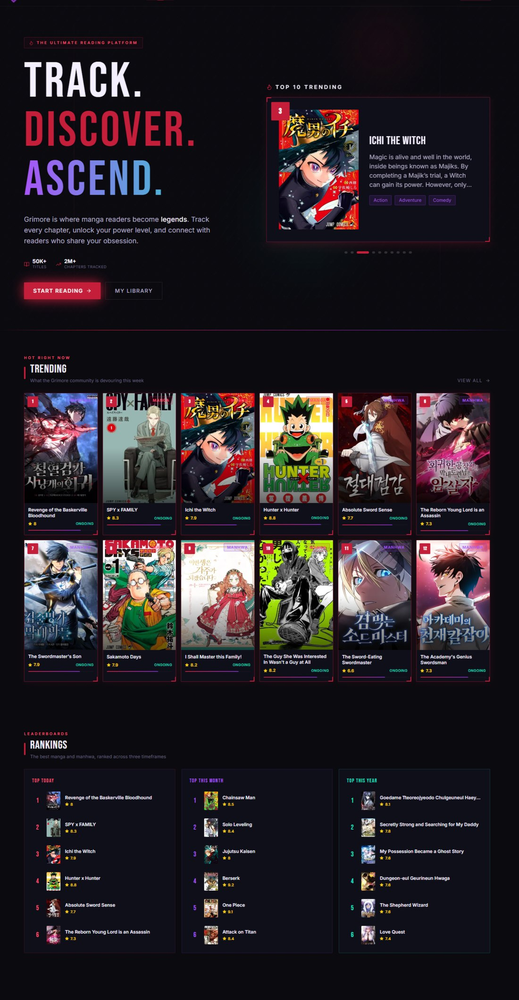

The front door. A hero built to hit like the cold open of a shounen premiere — **TRACK. DISCOVER. ASCEND.** in bold gradient type, backed by a single-book auto-advancing spotlight carousel that rotates through the Top 10 Trending titles every few seconds. Below the fold: a **live Trending grid**, three-tier **Leaderboards** (Today / This Month / This Year), one-click **genre jump-ins**, and a pulse of the **Community** feed — so a first-time visitor sees the whole ecosystem before they've even signed in.

**Five hand-tuned themes**, because not every reader wants obsidian-and-crimson at 3 AM:

  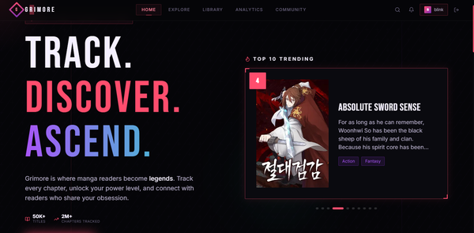
  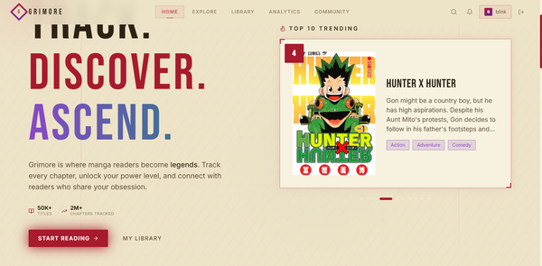
  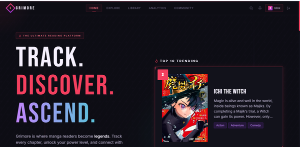
  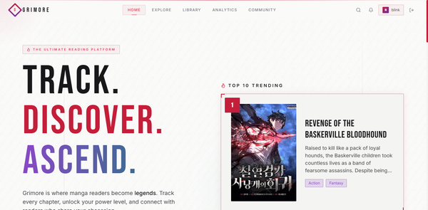

---

## 🧭 Explore

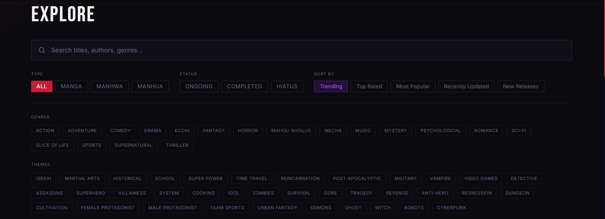

This is the hunting ground. Filter by **type** (Manga / Manhwa / Manhua), **status** (Ongoing / Completed / Hiatus), and sort by Trending, Top Rated, Most Popular, Recently Updated, or New Releases. Then stack it with **17 genres** and **30+ themes** — Isekai, Regression, Tragedy, Cultivation, System, you name it — until the grid narrows down to exactly the kind of story that scratches the itch. No more scrolling through a wall of shounen when you're craving a slow-burn romance.

---

## 📚 Book Details

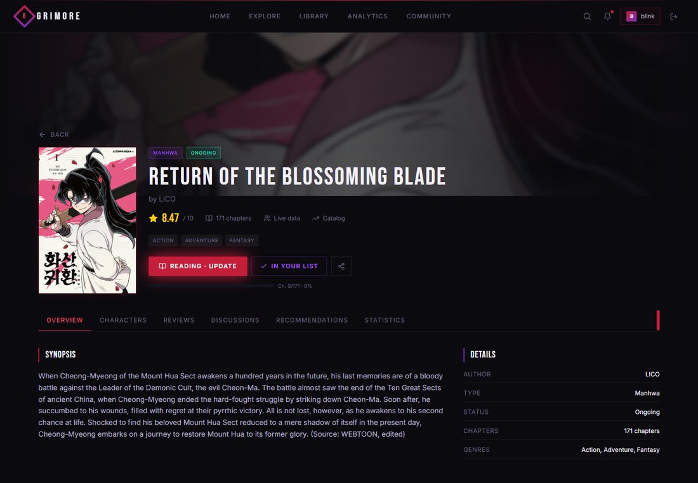

Every title gets its own shrine: cover art, live community rating, genre tags, full synopsis, and a details panel with author, type, status, and chapter count — all pulled from live catalog data, not a static snapshot.

But the real power move is the **reading tracker built directly into the page**. Tap in and set your status:

  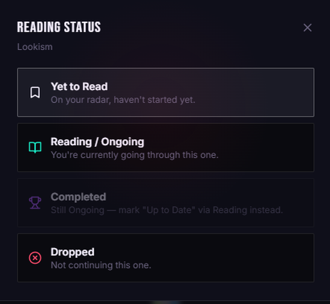

**Yet to Read → Reading → Completed → Dropped** — one tap, and your progress bar updates instantly, chapter count and all, synced straight to your Library and Analytics. No spreadsheets, no forgetting you're on chapter 156 of 171.

---

## ✍️ Author

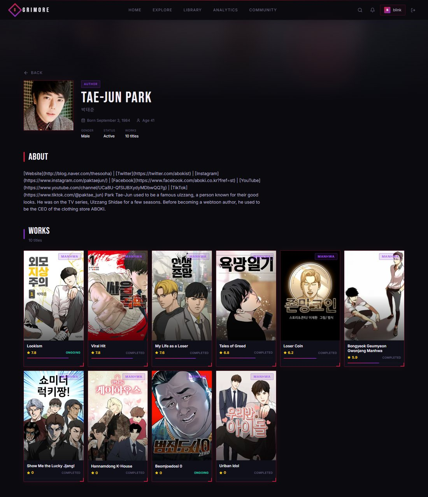

Every series has a name behind it, and Grimore doesn't bury that. Each author gets a full profile — portrait, birth date, status, social links — plus their **entire bibliography** laid out as a scrollable grid, ratings and status included. Find out the same mangaka behind your current obsession also wrote nine other titles you've never heard of, and fall down a whole new rabbit hole.

---

## 🎭 Characters

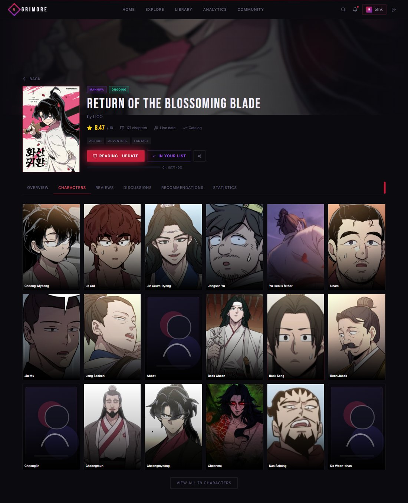

Every title's cast, laid out like a character select screen — up to dozens of faces per series, each one clickable.

  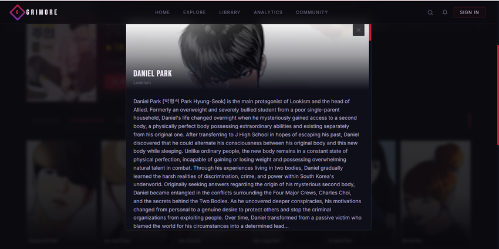

Tap a face and the **full dossier** slides in — origin, powers, backstory, the whole arc — without ever leaving the page you were reading on.

---

## ⭐ Reviews

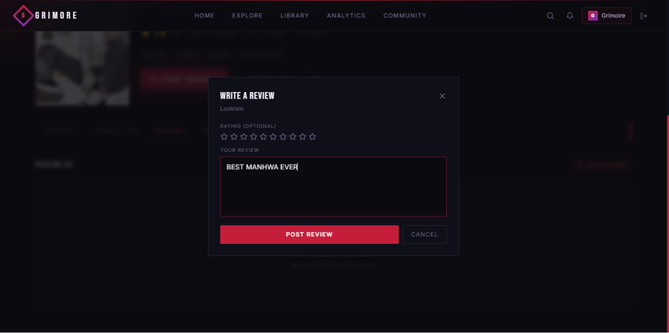

Every completed chapter deserves a verdict. Drop a star rating and a written take right from the title page — whether it's a three-paragraph essay on pacing or just **"BEST MANHWA EVER"** in all caps, both are valid reading culture.

---

## 🗂️ Library

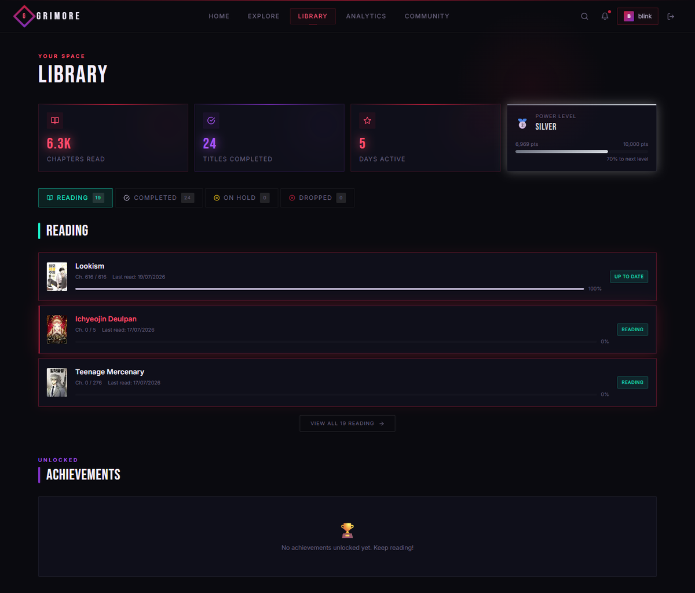

Home base. Every title sorted into **Reading / Completed / On Hold / Dropped**, with live progress bars per series — and sitting right beside it, the **Power Level** system: Bronze → Silver → Gold and beyond, climbing as chapters stack up. It's a reading list that gamifies the grind instead of just recording it.

---

## 📊 Analytics

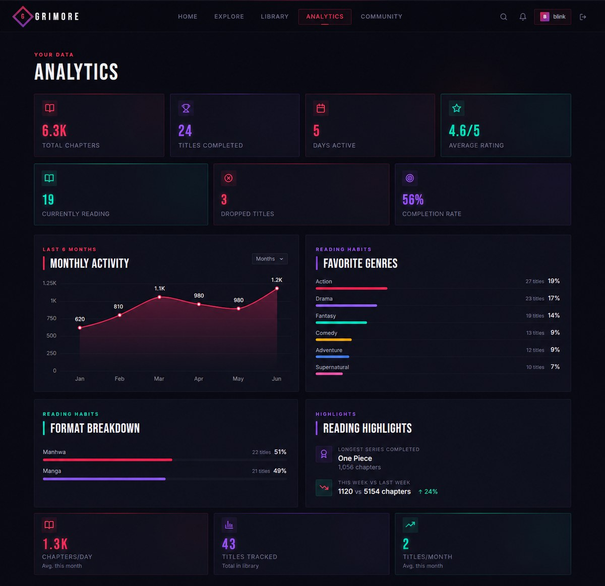

For readers who want the receipts. Total chapters devoured, completion rate, currently-reading count, a **Favorite Genres** breakdown, **Format split** (Manhwa vs. Manga), and Reading Highlights like your longest completed series and week-over-week chapter velocity. It's the stat screen after the boss fight — proof of the grind.

---

## 💬 Community

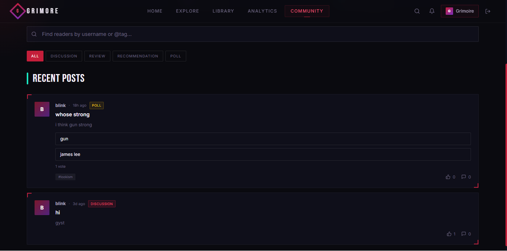

Where readers actually talk to each other. Discussions, reviews, recommendations, and polls (yes, people are out here debating "whose strong" and it's glorious), searchable by username or tag. Public profiles carry your **Power Level**, favorite books, and favorite characters straight into the feed — so every post comes with receipts.

---

*Built for readers, by a reader who got tired of losing their place.*

